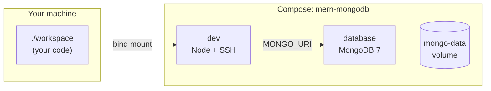

# dev-docker-image

Docker recipes and a legacy full-stack dev image. Repository owner on GitHub: **`felipeMello`**. Published images use **`ghcr.io/felipeMello/...`** (see below).

---

## What's in this repo

| Item | What it is |
|------|------------|
| [**`mern-mongodb`**](docker-stack-recipes/mern-mongodb/) | MERN **dev** stack: MongoDB + Node 20 + SSH (full guide in [MERN development stack](#mern-development-stack)). |
| **`legacy/full-stack`** | One big Ubuntu image: Java, Python, Node, PostgreSQL, SSH, etc. |
| **`pern-postgres`**, **`java-oracle-*`** | Not added yet (planned). |

Each recipe folder is its own Compose **project** (`name:` in the file), so stacks do not share containers or volumes.

**Not sure which to use?** See [Choosing a stack](#choosing-a-stack).

---

## Choosing a stack

Match **product shape**, **team skills**, and **risk/compliance**—not only language preference. These recipes are **development environments**; production always needs extra **security** (auth, TLS, secrets, network policy) on top of any stack.

### At a glance: value, complexity, and demand

| Stack | Complexity (typical dev setup) | Core business value | Where market demand is strongest |
|-------|--------------------------------|---------------------|----------------------------------|
| **[MERN](#mern-stack)** | **Lower** — few services, document model fits many early products | **Time-to-market** and **low schema friction** while requirements are still moving | Startups, agencies, SaaS, internal tools, JSON- and API-heavy products |
| **[PERN](#pern-stack)** — *planned* | **Medium** — relational modeling, migrations, SQL | **Data integrity**, **reporting**, **clear contracts** between services and analytics | B2B SaaS, marketplaces, ops tooling, teams that already rely on **SQL** |
| **[Java / Oracle](#java-and-oracle-stack)** — *planned* | **Higher** — JVM, enterprise patterns, Oracle operations | **Alignment with large enterprises**: long-term support, existing **Oracle/Java** estates | Regulated industries, banks, insurance, government vendors, central IT standards |
| **[Legacy](#legacy-full-stack-image)** | **High surface area** — many runtimes in one image | **Learning and experimentation** breadth—not focused product delivery | Training, spikes, polyglot demos—not the default for a shipping product team |

### MERN stack

| Lens | Notes |
|------|--------|
| **Business value** | Shorter path from **idea → working product** when data looks like **documents** (users, catalogs, configs, events). Less upfront modeling cost while you discover the domain. |
| **Typical businesses and projects** | **SaaS** MVPs (consumer or B2B), **content** and **catalog** systems, **dashboards**, APIs with **flexible** payloads, teams optimizing for **shipping frequency**. |
| **Values it supports** | **Agility**, **developer productivity**, patterns that map well to **horizontal scaling** in the cloud—*when you design production for that separately*. |
| **Security and talent** | **JavaScript/TypeScript** skills are **widely available** (strong hiring pool). Popularity also means **attacks target common mistakes** (auth, injection, dependencies)—secure engineering still matters. **This recipe** ships **dev defaults** (e.g. **no Mongo auth**, **SSH for local dev**): fine on a **trusted machine**; for production you must add **authentication**, **TLS**, **least privilege**, and **hardening**. |
| **When another stack fits better** | Heavy **relational reporting**, strict **tabular** rules, or procurement that expects **RDBMS** practices → **PERN**. Mandated **Oracle** stack → **Java / Oracle**. |

### PERN stack

*Recipe not in the repo yet.*

| Lens | Notes |
|------|--------|
| **Business value** | **Trust in structure**: constraints and SQL make behavior **explicit**—valuable when defects or ambiguity are expensive. |
| **Typical businesses and projects** | **Multi-tenant** B2B, **billing**-shaped data, **marketplaces**, **analytics**-heavy products, any domain that is naturally **rows and joins**. |
| **Values it supports** | **Correctness**, **auditability** (with good engineering), easy use of **BI and SQL** tooling. |
| **Security and talent** | **Postgres** expertise is **common**; operational playbooks are mature. Security still depends on **application and DB roles**, not the engine alone. A future dev recipe would still **not** be production-ready without auth, TLS, and policy. |
| **When MERN is simpler** | Very early stage, **schema changing weekly**, or data is **document-native**—MERN often **lowers** early complexity. |

### Java and Oracle stack

*Recipe not in the repo yet.*

| Lens | Notes |
|------|--------|
| **Business value** | **Enterprise fit**: vendor support, **integration** with existing **Oracle** systems, and alignment with **long-lived** IT roadmaps. |
| **Typical businesses and projects** | **Large enterprises**, **legacy integration**, **batch** and **transactional** systems with **formal** release processes. |
| **Values it supports** | **Stability**, **predictable support**, compliance with **architecture standards** set by central IT. |
| **Security and talent** | **Java** skills are common; **deep Oracle** skills are **rarer** and often **costlier**. Operational and **security** expectations are **enterprise-grade**—and so is **operational load**. |
| **When MERN or PERN is enough** | Greenfield **Node** product, small team, **no Oracle** constraint—usually **faster and cheaper** to operate. |

### Legacy full-stack image

| Lens | Notes |
|------|--------|
| **Business value** | **One environment** to **learn** or **compare** many technologies—high **exploration** value, low **focus** for a single product. |
| **Typical businesses and projects** | **Bootcamps**, **R&D**, **personal** sandboxing, demos that need **Java + Python + Node + Postgres** together. |
| **Values it supports** | **Convenience** and **breadth** over **minimal attack surface** and **operational simplicity**. |
| **Security and talent** | **Largest footprint** here (many packages and services; historical **dev-friendly** SSH defaults). Do **not** expose beyond **localhost** without hardening. **Not** a production architecture template. |
| **When to use a recipe instead** | A **clear** primary stack (MERN, PERN, etc.)—**narrow** the environment to reduce **complexity and risk**. |

### Rule of thumb

- **MERN** → **JS full-stack + evolving documents**; scale **security** with the business.
- **PERN** → **SQL and structure** as a deliberate advantage.
- **Java / Oracle** → **enterprise** and **vendor** reality already chosen for you.
- **Legacy** → **learn and experiment**; not the default for a **delivery** team.

---

## MERN development stack

In this repository, **MERN** means **MongoDB**, **Express** (or any Node HTTP API you choose), **React**, and **Node.js**—but as a **local development environment**, not a shipped demo app. You install frameworks in the mounted `workspace/` folder (e.g. Vite + React, Express + Mongoose). The stack gives you a database and a ready Node + SSH box; **you own the application code**.

### Architecture

Two services run under one Compose project named **`mern-mongodb`**:

| Service | Role |
|---------|------|
| **`database`** | Official **MongoDB 7** image. Data in a **named Docker volume** (`mongo-data`). Exposes **27017** on the host (optional to remove for stricter isolation). |
| **`dev`** | Custom image (**`mern-mongodb-dev:local`**) built from the recipe `Dockerfile`: **Node 20** (Debian bookworm), **git**, global **TypeScript / ts-node / nodemon**, **OpenSSH** (`sshd` on container port **22**). Your repo folder is **`./workspace` on the host → `/workspace` in the container**. |

The **`dev`** container reaches Mongo at hostname **`database`** on port **27017**; `MONGO_URI` is preset to `mongodb://database:27017/mern`. From your **host**, use **`localhost:27017`** with a local GUI or client.



Published **host ports** (defaults): **2222 → SSH**, **3000 / 5173 / 5000** for dev servers you start inside `dev`, **27017** for MongoDB. See the recipe README for SSH passwords and `MERN_SSH_PORT`.

### What kinds of projects it suits

Good fit when you want:

- **JavaScript/TypeScript** on the backend and **React** (or similar) on the frontend, with **MongoDB** as the primary store.
- **Flexible or evolving schemas** (documents, nested objects) without migrations for every change—typical for MVPs, dashboards, content-heavy apps, and product iteration.
- **One command** to get Mongo + Node + SSH without installing them on the host OS.

Less ideal when you need **strong relational constraints**, heavy **SQL reporting**, or **multi-row transactions** across many tables—**Postgres** (a future `pern-postgres` recipe) is often a better match there.

For business context (value, complexity, security, hiring) across stacks, see **[Choosing a stack](#choosing-a-stack)**.

### Why use it

- **Same environment for everyone**: same Node major, same Mongo version, same tools—fewer "works on my machine" issues.
- **Isolation**: Mongo and Node run in containers; your laptop stays clean; you can remove volumes when you want a fresh DB.
- **Remote-style workflow**: SSH into `dev` (or use **VS Code Remote-SSH**) as if it were a small cloud dev box, while files still live under **`workspace/`** on your disk.

### When to use it

- Starting or continuing a **MERN-style** app **locally** (or teaching / interviewing with a standard stack).
- You want **Docker Compose** as the single entrypoint instead of installing MongoDB and juggling Node versions on the host.
- You are **not** trying to production-deploy this Compose file as-is (no TLS, no Mongo auth in the default recipe—tighten that before real deployment).

### How to use it

1. **Start the stack** (builds the `dev` image the first time):

   ```bash
   cd docker-stack-recipes/mern-mongodb && docker compose up --build
   ```

   From repo root: `./scripts/mern-compose-up.sh`

2. **Work inside `dev`**: `docker compose exec dev bash` → `cd /workspace` → create or clone projects (`npm create vite@latest`, `npm init`, etc.).

3. **Connect to Mongo** from code in `dev`: use **`database`** as the host and **`MONGO_URI`** (already set in Compose).

4. **Optional — SSH from the host**: default **`ssh -p 2222 root@localhost`** (see recipe README for password and `./setup-ssh.sh` for keys).

More detail: [**recipe README**](docker-stack-recipes/mern-mongodb/README.md) (SSH, security), [**workspace README**](docker-stack-recipes/mern-mongodb/workspace/README.md) (scaffolding examples).

---

## Pull pre-built images (GitHub Container Registry)

Log in once (use a [GitHub PAT](https://github.com/settings/tokens) with `read:packages`, or `GITHUB_TOKEN` in CI):

```bash
docker login ghcr.io -u felipeMello
```

**Legacy full-stack image** (built by `docker-publish.yml`):

```bash
docker pull ghcr.io/felipeMello/dev-docker-image:latest
```

**MERN dev image** — not pushed by CI today. You build it locally (`mern-mongodb-dev:local`). If you publish it yourself under this account, a typical name would be:

```text
ghcr.io/felipeMello/mern-mongodb-dev:latest
```

---

## Build the legacy image locally

```bash
docker build -f legacy/full-stack/Dockerfile -t fullstack-dev:local .
```

SSH helper: [`legacy/README.md`](legacy/README.md).

---

## CI (GitHub Actions)

| Workflow | Purpose |
|----------|---------|
| `docker-publish.yml` | Build and push **`ghcr.io/felipeMello/dev-docker-image`** from `legacy/full-stack/Dockerfile`. |
| `mern-recipe.yml` | On changes under `docker-stack-recipes/mern-mongodb/`, Compose build + smoke test + informational Trivy on `mern-mongodb-dev:local`. |

---

## Contributing

Change only the recipe or workflow you care about so path-based CI stays fast.
