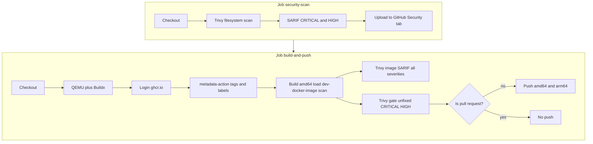

# dev-docker-image

Docker recipes and a legacy full-stack dev image. Repository owner on GitHub: **`felipeMello`**. Published images use **`ghcr.io/felipeMello/...`** (see below).

---

## What's in this repo

| Item | What it is |
|------|------------|
| [**`mern-mongodb`**](docker-stack-recipes/mern-mongodb/) | MERN **dev** stack: MongoDB 8 + Node.js 22 LTS + SSH (full guide in [MERN development stack](#mern-development-stack)). |
| [**`pern-postgres`**](docker-stack-recipes/pern-postgres/) | PERN **dev** stack: PostgreSQL 17 + Node.js 22 LTS + `psql` + SSH ([PERN development stack](#pern-development-stack)). |
| [**`java-oracle-enterprise`**](docker-stack-recipes/java-oracle-enterprise/) | Java / Oracle **dev** stack: Oracle 23c Free + JDK 21 + Maven + Node / Angular CLI + SSH ([Java / Oracle enterprise stack](#java--oracle-enterprise-stack)). |
| [**`kind-kubernetes`**](docker-stack-recipes/kind-kubernetes/) | **Local Kubernetes** with [Kind](https://kind.sigs.k8s.io/): multinode cluster config, scripts, **Helm**-based ingress bootstrap ([Kind / local Kubernetes](#kind--local-kubernetes)). |
| **`legacy/full-stack`** | One big Ubuntu image: Java, Python, Node, PostgreSQL, SSH, etc. |

Compose recipes are each their own **project** (`name:` in the file), so those stacks do not share containers or volumes. The **Kind** recipe does not use Compose; it uses **`kind create`** and host **`kubectl` / Helm**.

**Not sure which to use?** See [Choosing a stack](#choosing-a-stack).

---

## Choosing a stack

Match **product shape**, **team skills**, and **risk/compliance**—not only language preference. These recipes are **development environments**; production always needs extra **security** (auth, TLS, secrets, network policy) on top of any stack.

### At a glance: value, complexity, and demand

Each **Stack** cell is two lines: the **name** (link to the comparison below) and the **recipe folder** in this repo.

| Stack | Complexity (typical dev setup) | Core business value | Where market demand is strongest |
|-------|--------------------------------|---------------------|----------------------------------|
| **[MERN](#mern-stack)**<br>[`mern-mongodb`](docker-stack-recipes/mern-mongodb/) | **Lower** — few services, document model fits many early products | **Time-to-market** and **low schema friction** while requirements are still moving | Startups, agencies, SaaS, internal tools, JSON- and API-heavy products |
| **[PERN](#pern-development-stack)**<br>[`pern-postgres`](docker-stack-recipes/pern-postgres/) | **Medium** — relational modeling, migrations, SQL | **Data integrity**, **reporting**, **clear contracts** between services and analytics | B2B SaaS, marketplaces, ops tooling, teams that already rely on **SQL** |
| **[Java / Oracle](#java-and-oracle-stack)**<br>[`java-oracle-enterprise`](docker-stack-recipes/java-oracle-enterprise/) | **Higher** — JDK 21, Maven, Angular CLI, Oracle 23c Free in Docker | **Alignment with large enterprises**: long-term support, existing **Oracle/Java** estates | Regulated industries, banks, insurance, government vendors, central IT standards |
| **[Kind / Kubernetes](#kind--local-kubernetes)**<br>[`kind-kubernetes`](docker-stack-recipes/kind-kubernetes/) | **Medium–high** — cluster lifecycle, manifests, Helm charts | **Parity with K8s production patterns** locally (scheduling, ingress, operators) without cloud cost | Teams shipping to **Kubernetes**, platform engineers, chart/service development |
| **[Legacy](#legacy-full-stack-image)**<br>[`legacy/full-stack`](legacy/full-stack/) | **High surface area** — many runtimes in one image | **Learning and experimentation** breadth—not focused product delivery | Training, spikes, polyglot demos—not the default for a shipping product team |

### MERN stack

- **Recipe folder:** [`mern-mongodb`](docker-stack-recipes/mern-mongodb/)
- **Hands-on guide:** [MERN development stack](#mern-development-stack)

| Lens | Notes |
|------|--------|
| **Business value** | Shorter path from **idea → working product** when data looks like **documents** (users, catalogs, configs, events). Less upfront modeling cost while you discover the domain. |
| **Typical businesses and projects** | **SaaS** MVPs (consumer or B2B), **content** and **catalog** systems, **dashboards**, APIs with **flexible** payloads, teams optimizing for **shipping frequency**. |
| **Values it supports** | **Agility**, **developer productivity**, patterns that map well to **horizontal scaling** in the cloud—*when you design production for that separately*. |
| **Security and talent** | **JavaScript/TypeScript** skills are **widely available** (strong hiring pool). Popularity also means **attacks target common mistakes** (auth, injection, dependencies)—secure engineering still matters. **This recipe** uses **dev defaults** (e.g. **no Mongo auth**; **SSH is key-only** unless you set a password via **gitignored `.env`**): fine on a **trusted machine**; for production you must add **authentication**, **TLS**, **least privilege**, and **hardening**. |
| **When another stack fits better** | Heavy **relational reporting**, strict **tabular** rules, or procurement that expects **RDBMS** practices → **PERN**. Mandated **Oracle** stack → **Java / Oracle**. |

### PERN stack

- **Recipe folder:** [`pern-postgres`](docker-stack-recipes/pern-postgres/)
- **Hands-on guide:** [PERN development stack](#pern-development-stack)

| Lens | Notes |
|------|--------|
| **Business value** | **Trust in structure**: constraints and SQL make behavior **explicit**—valuable when defects or ambiguity are expensive. |
| **Typical businesses and projects** | **Multi-tenant** B2B, **billing**-shaped data, **marketplaces**, **analytics**-heavy products, any domain that is naturally **rows and joins**. |
| **Values it supports** | **Correctness**, **auditability** (with good engineering), easy use of **BI and SQL** tooling. |
| **Security and talent** | **Postgres** expertise is **common**; operational playbooks are mature. The recipe uses **`POSTGRES_PASSWORD` and related settings in gitignored `.env`** (see [`.env.example`](docker-stack-recipes/pern-postgres/.env.example)). Production still needs TLS, least privilege, and app-level hardening. |
| **When MERN is simpler** | Very early stage, **schema changing weekly**, or data is **document-native**—MERN often **lowers** early complexity. |

### Java and Oracle stack

- **Recipe folder:** [`java-oracle-enterprise`](docker-stack-recipes/java-oracle-enterprise/)
- **Hands-on guide:** [Java / Oracle enterprise stack](#java--oracle-enterprise-stack) (Compose, ports, JDBC, Oracle licensing)

| Lens | Notes |
|------|--------|
| **Business value** | **Enterprise fit**: vendor support, **integration** with existing **Oracle** systems, and alignment with **long-lived** IT roadmaps. |
| **Typical businesses and projects** | **Large enterprises**, **legacy integration**, **batch** and **transactional** systems with **formal** release processes. |
| **Values it supports** | **Stability**, **predictable support**, compliance with **architecture standards** set by central IT. |
| **Security and talent** | **Java** skills are common; **deep Oracle** skills are **rarer** and often **costlier**. Operational and **security** expectations are **enterprise-grade**—and so is **operational load**. |
| **When MERN or PERN is enough** | Greenfield **Node** product, small team, **no Oracle** constraint—usually **faster and cheaper** to operate. |

### Legacy full-stack image

- **Path:** [`legacy/full-stack`](legacy/full-stack/)
- **Docs:** [Legacy image notes](legacy/README.md)

| Lens | Notes |
|------|--------|
| **Business value** | **One environment** to **learn** or **compare** many technologies—high **exploration** value, low **focus** for a single product. |
| **Typical businesses and projects** | **Bootcamps**, **R&D**, **personal** sandboxing, demos that need **Java + Python + Node + Postgres** together. |
| **Values it supports** | **Convenience** and **breadth** over **minimal attack surface** and **operational simplicity**. |
| **Security and talent** | **Largest footprint** here (many packages and services; historical **dev-friendly** SSH defaults). Do **not** expose beyond **localhost** without hardening. **Not** a production architecture template. |
| **When to use a recipe instead** | A **clear** primary stack (MERN, PERN, Java/Oracle, etc.)—**narrow** the environment to reduce **complexity and risk**. |

### Rule of thumb

- **MERN** → **JS full-stack + evolving documents**; scale **security** with the business.
- **PERN** → **SQL and structure** as a deliberate advantage.
- **Java / Oracle** → **enterprise** and **vendor** reality — recipe [**`java-oracle-enterprise`**](docker-stack-recipes/java-oracle-enterprise/), [how-to above](#java-and-oracle-stack).
- **Kind / Kubernetes** → **cluster-native** workflows and **Helm** when Compose is not enough — [**`kind-kubernetes`**](docker-stack-recipes/kind-kubernetes/), [full guide](#kind--local-kubernetes).
- **Legacy** → **learn and experiment**; not the default for a **delivery** team.

---

## MERN development stack

In this repository, **MERN** means **MongoDB**, **Express** (or any Node HTTP API you choose), **React**, and **Node.js**—but as a **local development environment**, not a shipped demo app. You install frameworks in the mounted `workspace/` folder (e.g. Vite + React, Express + Mongoose). The stack gives you a database and a ready Node + SSH box; **you own the application code**.

**Architecture** (services, diagram, ports, `MONGO_URI`): [**`mern-mongodb` recipe README — Architecture**](docker-stack-recipes/mern-mongodb/README.md#architecture). **SSH and security:** same file and [`workspace/README.md`](docker-stack-recipes/mern-mongodb/workspace/README.md).

### What kinds of projects it suits

Good fit when you want:

- **JavaScript/TypeScript** on the backend and **React** (or similar) on the frontend, with **MongoDB** as the primary store.
- **Flexible or evolving schemas** (documents, nested objects) without migrations for every change—typical for MVPs, dashboards, content-heavy apps, and product iteration.
- **One command** to get Mongo + Node + SSH without installing them on the host OS.

Less ideal when you need **strong relational constraints**, heavy **SQL reporting**, or **multi-row transactions** across many tables—see the **[`pern-postgres`](docker-stack-recipes/pern-postgres/)** recipe.

For business context (value, complexity, security, hiring) across stacks, see **[Choosing a stack](#choosing-a-stack)**.

### Why use it

- **Same environment for everyone**: same Node major, same Mongo version, same tools—fewer "works on my machine" issues.
- **Isolation**: Mongo and Node run in containers; your laptop stays clean; you can remove volumes when you want a fresh DB.
- **Remote-style workflow**: SSH into `dev` (or use **VS Code Remote-SSH**) as if it were a small cloud dev box, while files still live under **`workspace/`** on your disk.

### When to use it

- Starting or continuing a **MERN-style** app **locally** (or teaching / interviewing with a standard stack).
- You want **Docker Compose** as the single entrypoint instead of installing MongoDB and juggling Node versions on the host.
- You are **not** trying to production-deploy this Compose file as-is (no TLS, no Mongo auth in the default recipe—tighten that before real deployment).

### How to use it

1. **Start the stack** (builds the `dev` image the first time):

   ```bash
   cd docker-stack-recipes/mern-mongodb && docker compose up --build
   ```

   From repo root: `./scripts/mern-compose-up.sh`

2. **Work inside `dev`**: `docker compose exec dev bash` → `cd /workspace` → create or clone projects (`npm create vite@latest`, `npm init`, etc.).

3. **Connect to Mongo** from code in `dev`: use **`database`** as the host and **`MONGO_URI`** (already set in Compose).

4. **Optional — SSH from the host**:
   - **Keys (default, no password):** in [`docker-stack-recipes/mern-mongodb/`](docker-stack-recipes/mern-mongodb/), run **`./setup-ssh.sh`**, then **`ssh -p 2222 root@localhost`**.
   - **Root password for SSH:** do **not** put the password in git. Copy **`docker-stack-recipes/mern-mongodb/.env.example`** to **`.env`** in that same folder, set **`SSH_ROOT_PASSWORD=...`**, then **`docker compose up -d --force-recreate dev`**. Full step-by-step: [**Root password for SSH (optional)**](docker-stack-recipes/mern-mongodb/README.md#root-password-for-ssh-optional) in the recipe README.

More detail: [**recipe README**](docker-stack-recipes/mern-mongodb/README.md), [**workspace README**](docker-stack-recipes/mern-mongodb/workspace/README.md).

---

## PERN development stack

**PERN** here means **PostgreSQL**, **Express** (or any Node API), **React**, and **Node.js**—as a **local dev environment**. You create apps under **`workspace/`** (e.g. Vite + React, Express + `pg`/Prisma/Drizzle). Configure the database via **`.env`** (see [`pern-postgres/.env.example`](docker-stack-recipes/pern-postgres/.env.example)); **`DATABASE_URL`** is injected into **`dev`**.

**Architecture** (services, diagram, ports, **`DATABASE_URL`**): [**`pern-postgres` recipe README — Architecture**](docker-stack-recipes/pern-postgres/README.md#architecture). **Configuration and SSH:** same file and [`workspace/README.md`](docker-stack-recipes/pern-postgres/workspace/README.md).

### How to use it

```bash
cd docker-stack-recipes/pern-postgres
cp .env.example .env
# edit .env — set POSTGRES_PASSWORD and any ports
docker compose up --build
```

From repo root: **`./scripts/pern-compose-up.sh`**

- **SSH / ports:** see [**recipe README — Architecture**](docker-stack-recipes/pern-postgres/README.md#architecture) and [**SSH**](docker-stack-recipes/pern-postgres/README.md#ssh-remote--vs-code-remote-ssh).
- **Full docs:** [**recipe README**](docker-stack-recipes/pern-postgres/README.md), [**workspace README**](docker-stack-recipes/pern-postgres/workspace/README.md).

---

## Java / Oracle enterprise stack

In this repository, the **Java / Oracle** recipe is a **local development environment**: **Oracle Database 23c Free** (Docker) plus a **`dev`** container with **JDK 21**, **Maven**, **Node.js 22** (multi-stage copy from the official Node image), and a **pinned Angular CLI** (see the recipe Dockerfile). You organize the app as **`angular-client/`** and **`spring-api/`** next to `docker-compose.yml` (mounted at **`/workspace`** inside **`dev`**). A small **Spring Boot** sample lives under [`spring-api/`](docker-stack-recipes/java-oracle-enterprise/spring-api/); **you own** how far you grow it.

**Architecture** (services, ports, JDBC, licensing): [**`java-oracle-enterprise` recipe README**](docker-stack-recipes/java-oracle-enterprise/README.md). **Angular / Spring layout:** [`angular-client/README.md`](docker-stack-recipes/java-oracle-enterprise/angular-client/README.md), [`spring-api/README.md`](docker-stack-recipes/java-oracle-enterprise/spring-api/README.md).

### How to use it

```bash
cd docker-stack-recipes/java-oracle-enterprise
cp .env.example .env
# set ORACLE_PASSWORD at least for non-throwaway environments
docker compose up --build
```

From repo root: **`./scripts/java-oracle-compose-up.sh`**

- **Oracle** may take **several minutes** on first run while the data volume initializes.
- **SSH:** default host port **2224** — see the recipe README and **`.env.example`** (`JAVA_ORACLE_SSH_PORT`, `SSH_ROOT_PASSWORD`).
- **CI:** [`java-oracle-recipe.yml`](.github/workflows/java-oracle-recipe.yml) builds the stack and runs smoke checks (slow job: image pull + DB startup).

For business context (value, complexity, security, hiring), see **[Choosing a stack — Java and Oracle](#java-and-oracle-stack)**.

---

## Kind / local Kubernetes

Recipe: [`docker-stack-recipes/kind-kubernetes/`](docker-stack-recipes/kind-kubernetes/). This path uses **[Kind](https://kind.sigs.k8s.io/)** to run a **multinode** cluster (default **1 control-plane + 2 workers**) inside Docker. You install **Kind**, **kubectl**, and **Helm 3** on the **host**; there is **no** bundled app database and **no** Compose file—see the [**recipe README — Prerequisites**](docker-stack-recipes/kind-kubernetes/README.md#prerequisites) for version skew and tooling.

### What kinds of projects it suits

Good fit when you want:

- **Kubernetes** as the unit of deployment (Deployments, Services, Ingress, Helm charts) and need a **fast local loop** without a cloud cluster.
- **Multinode** behaviour (scheduling across workers) with **low setup cost** compared to managed Kubernetes.
- **Ingress** on **localhost** via documented **Helm** steps and **`extraPortMappings`** (see [**ingress + Helm bootstrap**](docker-stack-recipes/kind-kubernetes/README.md#ingress--helm-bootstrap)).

Less ideal when a **single Compose stack** with a dev container and database is enough—**MERN** or **PERN** stay simpler for that shape.

### How to use it

1. **Install** Docker, Kind, kubectl, and Helm 3 (recipe README links releases and Helm install).

2. **Create the cluster** (default name `dev-local`, configurable with `KIND_CLUSTER_NAME`):

   ```bash
   cd docker-stack-recipes/kind-kubernetes && ./scripts/cluster-up.sh
   ```

   From repo root: **`./scripts/kind-cluster-up.sh`**

3. **Point kubectl** at the context `kind-<cluster-name>` and verify nodes: **`kubectl get nodes`**.

4. **Optional — ingress-nginx:** run **`./scripts/install-ingress.sh`** (or follow the copy-paste Helm block in the recipe README).

5. **Teardown:** **`./scripts/cluster-down.sh`** or **`kind delete cluster --name …`**.

**Advanced:** multi–control-plane Kind config is provided as **`kind-config-ha-control-plane.yaml`** with explicit **resource warnings** in the recipe README.

More detail: [**`kind-kubernetes` recipe README**](docker-stack-recipes/kind-kubernetes/README.md).

---

## Pull pre-built images (GitHub Container Registry)

Log in once (use a [GitHub PAT](https://github.com/settings/tokens) with `read:packages`, or `GITHUB_TOKEN` in CI):

```bash
docker login ghcr.io -u felipeMello
```

**Legacy full-stack image** (built by `docker-publish.yml`):

```bash
docker pull ghcr.io/felipeMello/dev-docker-image:latest
```

**MERN / PERN / Java–Oracle dev images** — **not pushed by CI** (see [Recipe workflows](#recipe-workflows) below). Build locally (`mern-mongodb-dev:local`, `pern-postgres-dev:local`, `java-oracle-enterprise-dev:local`). Example GHCR names if you publish yourself:

```text
ghcr.io/felipeMello/mern-mongodb-dev:latest
ghcr.io/felipeMello/pern-postgres-dev:latest
ghcr.io/felipeMello/java-oracle-enterprise-dev:latest
```

---

## CI/CD (GitHub Actions)

All workflows live under [`.github/workflows/`](.github/workflows/). They use **Docker Buildx**, **GitHub Container Registry (`ghcr.io`)**, and **[Trivy](https://github.com/aquasecurity/trivy)** for scanning.

### Overview

| Workflow | File | What it produces | Pushes to GHCR? |
|----------|------|------------------|-----------------|
| **Legacy image — build & publish** | [`docker-publish.yml`](.github/workflows/docker-publish.yml) | **`ghcr.io/felipeMello/dev-docker-image`** (`:latest`, branch, SHA, semver tags) | **Yes** (not on PRs) |
| **MERN recipe** | [`mern-recipe.yml`](.github/workflows/mern-recipe.yml) | Validates **`mern-mongodb-dev:local`** | **No** |
| **PERN recipe** | [`pern-recipe.yml`](.github/workflows/pern-recipe.yml) | Validates **`pern-postgres-dev:local`** | **No** |
| **Java Oracle recipe** | [`java-oracle-recipe.yml`](.github/workflows/java-oracle-recipe.yml) | Validates **`java-oracle-enterprise-dev:local`** (Oracle smoke; **longer** runtime) | **No** |
| **Kind recipe** | [`kind-recipe.yml`](.github/workflows/kind-recipe.yml) | Kind cluster smoke (`kubectl` / Helm); **no** image publish | **No** |

---

### Conventions (supply chain & developer experience)

- **Pinned Actions:** Third-party actions use **immutable release tags**, not `@main` / `@master` — e.g. **`aquasecurity/trivy-action@v0.35.0`**. [Dependabot](.github/dependabot.yml) opens weekly PRs for GitHub Actions updates.
- **Recipe smoke tests:** **`docker compose up -d --wait`** so services with **`healthcheck`** are ready before **`exec`**; **`docker compose down`** runs in a follow-up step with **`if: always()`** so a failed assertion does not leave containers on the runner.
- **Workflow concurrency:** **`docker-publish`** and each recipe workflow use a **`concurrency`** group so newer pushes to the same ref cancel superseded runs (fewer wasted minutes).
- **Contributing:** [CONTRIBUTING.md](CONTRIBUTING.md) describes how to add recipes and keep CI consistent.

---

### Trivy, SARIF, and what is actually scanned

**Trivy** ([Aquasecurity](https://github.com/aquasecurity/trivy)) is the **scanner**. It compares what it finds against vulnerability (and related) databases. This repo uses it in two different **modes**; they answer different questions:

| Mode | What gets read | Typical findings | In this repo |
|------|----------------|------------------|--------------|
| **Filesystem (`scan-type: fs`)** | The **checked-out Git tree** on the CI runner (files under the repo root). | Known issues tied to **files in the repo**: dependency manifests and lockfiles, Dockerfiles / Compose in the tree, sometimes **secrets** or **misconfigurations** depending on Trivy’s enabled scanners. It does **not** run your application or mount the built container. | Job **`security-scan`** — runs **before** the legacy image is built in the same workflow. |
| **Container image (`image-ref: …`)** | **Layers of a built OCI image** (what `docker build` produced). | CVEs in **packages actually installed inside the image** (e.g. `apt` packages, language runtimes, layers copied in). Can differ from “repo only” if the Dockerfile installs things not fully reflected in a lockfile you scan on disk. | Job **`build-and-push`** — after **`dev-docker-image:scan`** is built and loaded on the runner. |

**SARIF** ([Static Analysis Results Interchange Format](https://docs.oasis-open.org/sarif/sarif/v2.1.0/sarif-v2.1.0.html)) is **not** a separate scanner. It is a **standard JSON format for listing findings** (rule id, location, severity, etc.). Here, **Trivy writes SARIF**; the GitHub Action **`codeql-action/upload-sarif`** **uploads** that file so results can appear under the repository **Security** tab (code scanning / security alerts). Steps that use **`format: table`** are for **logs and pass/fail** in the Actions UI — they are still Trivy; they just don’t produce a SARIF upload.

**Gating vs informational:** **`exit-code: 1`** (and no `continue-on-error`) **fails the job** — used as a **release gate** so a bad image is not pushed. **`exit-code: 0`** / **`continue-on-error: true`** means **report only**; the workflow can still succeed.

---

### Where CI fits in the SDLC

Rough lifecycle phases and how these workflows line up:

| SDLC phase | What happens | This repository |
|------------|--------------|-----------------|
| **Local development** | Implement and test on a workstation. | You build recipes with Compose or the legacy Dockerfile locally (see [Build the legacy image locally](#build-the-legacy-image-locally)); no GitHub runner involved. |
| **Integration / pre-merge (CI on PR or push)** | Automated build + tests + scans on every change. | **`docker-publish.yml`** on PRs: filesystem Trivy, then build the legacy image, image Trivy (SARIF + table gate), **no push** to GHCR. **Recipe workflows**: `compose build`, smoke tests, **informational** Trivy on the local tag — they **do not block** on CVE noise. |
| **Mainline / release (after merge or tag)** | Trusted artifact is published or tagged. | **`docker-publish.yml`** on default branch or **`v*.*.*` tags**: same scans, then **push** multi-arch image to **`ghcr.io`**. SARIF uploads run when the event is **not** a `pull_request` (fork/permission friendliness). |
| **Operate / consume** | Teams pull and run the image. | **`docker pull ghcr.io/...`** — the **image** scan is the closest automated check to “what we ship in the registry.” |

So: **filesystem Trivy** is **early feedback on the repository** (shift-left on sources and declared dependencies). **Image Trivy** is **verification of the built shipping artifact** before (or without) publish, depending on branch/event.

---

### Legacy image pipeline (`docker-publish.yml`)

**Triggers:** push to **`main`**, **`master`**, or **`felipeSilvaDeMelloStudentAccount`**; tags matching **`v*.*.*`**; **pull requests** targeting those branches; **workflow_dispatch** (manual).

**Registry & image name:** `REGISTRY=ghcr.io`, `IMAGE_NAME` = the GitHub repo (`owner/name`) → **`ghcr.io/felipeMello/dev-docker-image`** for this repository (use your fork’s path if applicable).



**Job 1 — `security-scan`**

1. **Checkout** the repo.
2. **Trivy** in **filesystem** mode over the whole tree (`scan-type: fs`), severities **CRITICAL** and **HIGH**, output **SARIF**.
3. **Upload SARIF** to the repository **Security** tab (`codeql-action/upload-sarif`) — skipped for **pull_request** events so forks don’t require extra permissions for uploads.

**Job 2 — `build-and-push`** (runs only after `security-scan` succeeds)

1. **Checkout**, **QEMU**, **Buildx** — enables **multi-arch** builds on GitHub-hosted runners.
2. **Login** to **`ghcr.io`** with **`GITHUB_TOKEN`** (needs `packages: write`).
3. **`docker/metadata-action`** — computes image **tags** (branch name, PR ref, semver from `v*.*.*` tags, `latest` on default branch, SHA-prefixed tags, etc.).
4. **Build (scan pass)** — `docker/build-push-action` with **context `.`**, **`legacy/full-stack/Dockerfile`**, **`push: false`**, **`load: true`**, **`linux/amd64` only**, tag **`dev-docker-image:scan`**. Uses **GitHub Actions cache** (`type=gha`) for layers.
5. **Trivy on the built image (reporting)** — scan **`dev-docker-image:scan`**, all severities → **SARIF**, **`continue-on-error: true`**, **`exit-code: 0`**; upload SARIF when **not** a PR (same as job 1). Skips noisy npm cache paths under **`root/.npm/_cacache/**`**.
6. **Trivy on the built image (gate)** — same image, **table** output, **CRITICAL/HIGH**, **`ignore-unfixed: true`**, **`exit-code: 1`** — **fails the workflow** if unfixed issues remain, so a vulnerable image is **not** published.
7. **Push** — runs **only if** `github.event_name != 'pull_request'`. Second **`build-push-action`** with **`push: true`**, **`platforms: linux/amd64,linux/arm64`**, tags and labels from metadata. PRs still run steps 1–6 but **never push**.

After a successful push, the job appends a short **summary** to the Actions run (image ref, tags, pull command, link to **Security**).

---

### Recipe workflows

These workflows **do not publish** images. They keep recipe Dockerfiles honest when only recipe paths change.

| Workflow | Paths that trigger it |
|----------|------------------------|
| [`mern-recipe.yml`](.github/workflows/mern-recipe.yml) | `docker-stack-recipes/mern-mongodb/**` or edits to that workflow |
| [`pern-recipe.yml`](.github/workflows/pern-recipe.yml) | `docker-stack-recipes/pern-postgres/**` or edits to that workflow |
| [`java-oracle-recipe.yml`](.github/workflows/java-oracle-recipe.yml) | `docker-stack-recipes/java-oracle-enterprise/**` or edits to that workflow |
| [`kind-recipe.yml`](.github/workflows/kind-recipe.yml) | `docker-stack-recipes/kind-kubernetes/**` or edits to that workflow |

**Triggers:** **push** and **pull_request** (filtered by paths above), plus **workflow_dispatch**.

**Typical steps (each recipe):**

1. **Checkout**
2. **`docker compose build`** in the recipe directory — produces **`mern-mongodb-dev:local`**, **`pern-postgres-dev:local`**, or **`java-oracle-enterprise-dev:local`**
3. **Smoke test** — **`docker compose up -d --wait`**, then inside **`dev`**: **`node --version`**, **`pgrep sshd`**, database ping (**`mongosh`** / **`pg_isready`** + **`psql`** / for Java–Oracle: **`java`**, **`mvn`**, **`sqlplus`** against **`database`**). **PERN** sets **`POSTGRES_PASSWORD`** and **`PERN_SSH_PORT`**; **Java Oracle** sets **`ORACLE_PASSWORD`**, **`JAVA_ORACLE_SSH_PORT`**, and uses a **45-minute** job timeout for the DB image; **`docker compose down`** runs **`if: always()`** after smoke (including **MERN**, so failed smokes still tear down).
4. **Trivy** on the **local** dev image tag — **table** output, all severities listed, **`exit-code: 0`**, **`continue-on-error: true`** — **informational only** (does not block merges on CVE noise for dev bases).

**Kind recipe** ([`kind-recipe.yml`](.github/workflows/kind-recipe.yml)): creates a **slim** Kind cluster (`kind-config-ci.yaml`: 1 control-plane + 1 worker) with pinned **[`helm/kind-action`](https://github.com/helm/kind-action)**; runs **`kubectl get nodes`**, **`helm version`**, and a short **Job** smoke test; **`kind delete cluster`** in **`if: always()`** so failures do not leave Kind containers on the runner.

---

### Permissions & secrets

- **`docker-publish`**: `security-events: write` for SARIF uploads; `packages: write` to push to **`ghcr.io`**. Uses **`secrets.GITHUB_TOKEN`** (no extra repo secrets required for publish).
- **Recipe workflows**: **`permissions: contents: read`** only; no registry login.

---

## Build the legacy image locally

```bash
docker build -f legacy/full-stack/Dockerfile -t fullstack-dev:local .
```

SSH helper: [`legacy/README.md`](legacy/README.md).

---

## Contributing

Change only the recipe or workflow you care about so path-based CI stays fast. See **[CONTRIBUTING.md](CONTRIBUTING.md)** for Actions pinning, smoke-test patterns, and how to add a new stack recipe.
