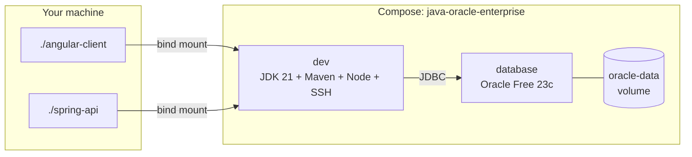

# Java / Oracle enterprise development stack

Docker Compose project **`java-oracle-enterprise`**: an Oracle **database** service and a **`dev`** service with **JDK 21**, **Maven**, **Node.js 22** (global **Angular CLI**), and **OpenSSH**. Application code is expected under **`angular-client/`** and **`spring-api/`** at the recipe root (mounted at **`/workspace`** in **`dev`**).

## Versions (pinned images / base)

| Piece | Version |
|-------|---------|
| Oracle Database | **23c Free** ([`gvenzl/oracle-free:23-slim`](https://hub.docker.com/r/gvenzl/oracle-free)) |
| JDK (`dev`) | **21** ([Eclipse Temurin](https://adoptium.net/) noble) |
| Node.js (`dev`) | **22.x** (binaries copied from official [`node:22-bookworm`](https://hub.docker.com/_/node), same major as MERN/PERN) |
| Angular CLI (`dev`, global) | **19.2.0** (pinned in [`Dockerfile`](Dockerfile)) |
| Spring Boot (sample API) | **3.4.x** (see [`spring-api/pom.xml`](spring-api/pom.xml)) |

## Licensing

The **`gvenzl/oracle-free`** image is intended for **development and learning**. **Production** use of Oracle Database is subject to [Oracle’s licensing terms](https://www.oracle.com/legal/licensing.html). This recipe does **not** replace legal or procurement review.

## First run

**First startup can take several minutes** while the database initializes the data volume.

```bash
cd docker-stack-recipes/java-oracle-enterprise
cp .env.example .env
# edit .env — set ORACLE_PASSWORD for anything beyond local throwaway dev
docker compose up --build
docker compose exec dev bash
```

From repo root: **`./scripts/java-oracle-compose-up.sh`**

Optional SSH: [`.env.example`](.env.example) (`SSH_ROOT_PASSWORD`, **`JAVA_ORACLE_SSH_PORT`**). **Never commit `.env`.**

## Architecture

| Service | Role |
|---------|------|
| **`database`** | **Oracle Database 23c Free** in Docker. Persistent volume **`oracle-data`**. Listener **1521** (see **Host ports**). |
| **`dev`** | Image **`java-oracle-enterprise-dev:local`**: **JDK 21**, **Maven**, **Node 22**, **@angular/cli**, **OpenSSH** on container port **22**. Bind mount **`.` (recipe root) → `/workspace`** — so **`angular-client/`** and **`spring-api/`** are **`/workspace/angular-client`** and **`/workspace/spring-api`**. |

**JDBC from `dev`:** `jdbc:oracle:thin:@//database:1521/FREEPDB1` with user **`system`** and password **`ORACLE_PASSWORD`** (dev-only defaults; use an application schema in real projects).



### Host ports (defaults)

| Host | Container | Purpose |
|------|------------|---------|
| **2224** | 22 | SSH (`JAVA_ORACLE_SSH_PORT` in `.env`) |
| **8080** | 8080 | Spring Boot when you run it in `dev` |
| **4200** | 4200 | Angular `ng serve` in `dev` |
| **1521** | 1521 | Oracle listener (`ORACLE_PORT` in `.env`) |

SSH is **key-only** unless **`SSH_ROOT_PASSWORD`** is set in **`.env`**.

## SSH (remote / VS Code Remote-SSH)

- **`sshd`** listens on port **22** inside **`dev`**.
- Default host mapping **`2224 → 22`**. Override with **`JAVA_ORACLE_SSH_PORT`** in **`.env`**.

### Key-based SSH (default)

```bash
./setup-ssh.sh
ssh -p 2224 root@localhost
```

### Root password for SSH (optional)

Set **`SSH_ROOT_PASSWORD`** only in a **gitignored `.env`**, then **`docker compose up -d --force-recreate dev`**.

## Sample Spring API

See [`spring-api/README.md`](spring-api/README.md). Summary:

```bash
docker compose exec dev bash
cd /workspace/spring-api && mvn -q spring-boot:run
```

## Angular front end

See [`angular-client/README.md`](angular-client/README.md).

## Troubleshooting

- **`ORA-12514` / service name**: Confirm the PDB service name for your image tag (`FREEPDB1` vs `FREE`) in [gvenzl/oracle-free](https://hub.docker.com/r/gvenzl/oracle-free) docs and align **`SPRING_DATASOURCE_URL`** / JDBC URL.
- **Database slow to become healthy**: Increase wait time or check `docker compose logs database`.
