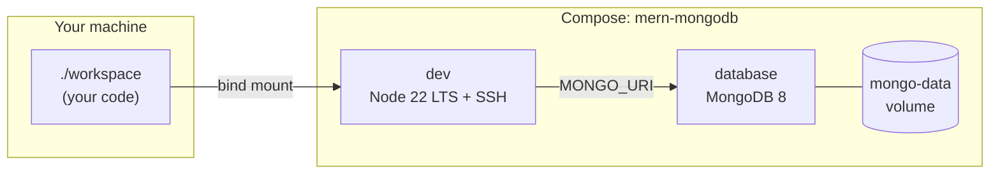

# MERN development stack

Docker Compose project **`mern-mongodb`**: a **`database`** service and a **`dev`** service. Your code lives in [`workspace/`](workspace/), mounted at **`/workspace`** inside **`dev`**.

## Versions (pinned images / base)

| Piece | Version |
|-------|---------|
| MongoDB | **8.x** (`mongo:8`) |
| Node.js (dev image) | **22.x LTS** (`node:22-bookworm`) |

## First run

```bash
docker compose up --build
docker compose exec dev bash
```

Optional SSH settings: copy [`.env.example`](.env.example) to **`.env`** in this directory (see [SSH](#ssh-remote--vs-code-remote-ssh) below). **Never commit `.env`.**

## Architecture

Compose project name: **`mern-mongodb`**. Two services:

| Service | Role |
|---------|------|
| **`database`** | **MongoDB 8** (`mongo:8`). Persistent Docker volume **`mongo-data`**. Container port **27017** published on the host (see **Host ports**). |
| **`dev`** | Image **`mern-mongodb-dev:local`** (this folder’s `Dockerfile`): **Node.js 22 LTS** (Debian bookworm), **git**, global **typescript** / **ts-node** / **nodemon**, **OpenSSH** (`sshd` on container port **22**). Bind mount **`./workspace` → `/workspace`**. |

**Connectivity:** from **`dev`**, MongoDB is **`database:27017`**. Compose sets **`MONGO_URI=mongodb://database:27017/mern`**. From your **host**, clients can use **`localhost:27017`** (same published port).



### Host ports (defaults)

| Host | Container | Purpose |
|------|------------|---------|
| **2222** | 22 | SSH (`MERN_SSH_PORT` in `.env`) |
| **3000** | 3000 | Dev server you start in `dev` |
| **5173** | 5173 | Vite default |
| **5000** | 5000 | Typical Express API |
| **27017** | 27017 | MongoDB |

SSH is **key-only** unless **`SSH_ROOT_PASSWORD`** is set in **`.env`** ([below](#root-password-for-ssh-optional)).

## SSH (remote / VS Code Remote-SSH)

- **`sshd`** listens on port **22** inside **`dev`**.
- On the **host**, that is mapped as **`2222` → 22** by default. Override with **`MERN_SSH_PORT`** in **`.env`** (see [`.env.example`](.env.example)).

There is **no root password** baked into the image. Use **SSH keys** (recommended) or set a password **only** via **`.env`**.

### Key-based SSH (default)

With the stack running, from this directory:

```bash
./setup-ssh.sh
ssh -p 2222 root@localhost
```

You can also use **`docker compose exec dev bash`** and skip SSH.

### Root password for SSH (optional)

The password is applied when **`dev`** **starts**. Set **`SSH_ROOT_PASSWORD`** only in a **gitignored `.env`** next to `docker-compose.yml` — never in `docker-compose.yml` or any committed file.

1. `cd` into **`docker-stack-recipes/mern-mongodb`** (this folder).
2. `cp .env.example .env`
3. Edit **`.env`** and set **`SSH_ROOT_PASSWORD`**. For special characters (`#`, `$`, spaces, etc.), wrap the value in **single quotes**:
   ```bash
   SSH_ROOT_PASSWORD='my$complex#secret'
   ```
4. Recreate **`dev`** so the entrypoint sees the new value:
   ```bash
   docker compose up -d --build --force-recreate dev
   ```
5. Connect:
   ```bash
   ssh -p 2222 root@localhost
   ```

Compose loads **`.env`** automatically for variable substitution, so **`SSH_ROOT_PASSWORD`** reaches the container without putting it in YAML.

**Change or remove the password:** edit **`.env`**, then run **`docker compose up -d --force-recreate dev`** again. If **`SSH_ROOT_PASSWORD`** is empty or unset, password login is off—use **`./setup-ssh.sh`** or **`docker compose exec`**.

**Host port 22 instead of 2222:** set **`MERN_SSH_PORT=22`** in **`.env`** (only if host port 22 is free).

## Security

For **local development** only. Harden SSH and Mongo before any wider exposure. This recipe ships **without Mongo authentication** and publishes **27017** on the host—narrow or remove that mapping if **`dev`** is the only consumer of Mongo.
