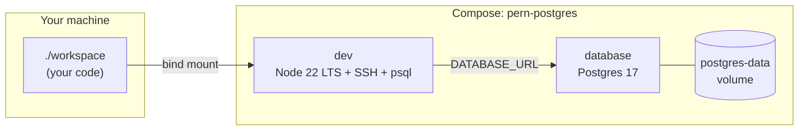

# PERN development stack

Docker Compose project **`pern-postgres`**: a **`database`** service (PostgreSQL) and a **`dev`** service (Node). Your code lives in [`workspace/`](workspace/), mounted at **`/workspace`** inside **`dev`**.

## Versions (pinned images / base)

| Piece | Version |
|-------|---------|
| PostgreSQL | **17.x** (`postgres:17-alpine`) |
| Node.js (dev image) | **22.x LTS** (`node:22-bookworm`) |

## Configuration

Copy [`.env.example`](.env.example) to **`.env`** in this directory before the first meaningful run. **Never commit `.env`.**

| Variable | Purpose |
|----------|---------|
| **`POSTGRES_USER`**, **`POSTGRES_PASSWORD`**, **`POSTGRES_DB`** | Database role, password, and database name. **`dev`** receives matching **`POSTGRES_*`** and a **`DATABASE_URL`** for tools like Prisma, Drizzle, **`pg`**, Sequelize. |
| **`PERN_PG_PORT`** | Host port mapped to Postgres **5432** (default **5432**). |
| **`PERN_SSH_PORT`** | Host port mapped to SSH **22** inside **`dev`** (default **2223**). |
| **`SSH_ROOT_PASSWORD`** | Optional; see **SSH** section below. |

Use a **URL-safe** **`POSTGRES_PASSWORD`** (e.g. letters, numbers, underscore) if you rely on the composed **`DATABASE_URL`**. Characters such as **`@`**, **`:`**, **`/`**, **`#`** break URLs unless you encode them in application config.

## First run

```bash
cp .env.example .env
# edit .env — at minimum set POSTGRES_PASSWORD
docker compose up --build
docker compose exec dev bash
```

## Architecture

Compose project name: **`pern-postgres`**. Two services:

| Service | Role |
|---------|------|
| **`database`** | **PostgreSQL 17** (`postgres:17-alpine`). Persistent volume **`postgres-data`**. Container port **5432** published on the host as **`PERN_PG_PORT`** (default **5432**). Credentials from **`.env`**: **`POSTGRES_USER`**, **`POSTGRES_PASSWORD`**, **`POSTGRES_DB`**. |
| **`dev`** | Image **`pern-postgres-dev:local`** (this folder’s `Dockerfile`): **Node.js 22 LTS** (Debian bookworm), **git**, **`psql`**, global **typescript** / **ts-node** / **nodemon**, **OpenSSH** (container port **22**). Bind mount **`./workspace` → `/workspace`**. |

**Connectivity:** from **`dev`**, Postgres is **`database:5432`**. Compose builds **`DATABASE_URL`** from the same **`POSTGRES_*`** values as the **`database`** service. **`dev`** also receives **`POSTGRES_*`** for apps that read them separately.



### Host ports (defaults)

| Host | Container | Purpose |
|------|------------|---------|
| **`PERN_SSH_PORT` (2223)** | 22 | SSH |
| **3000** | 3000 | Dev server in `dev` |
| **5173** | 5173 | Vite default |
| **5000** | 5000 | Typical Express API |
| **`PERN_PG_PORT` (5432)** | 5432 | PostgreSQL |

Default SSH host port **2223** avoids clashing with another stack using **2222**. App ports **3000 / 5173 / 5000** match common Node recipes—run one stack at a time on those ports or remap on the host.

## SSH (remote / VS Code Remote-SSH)

- **`sshd`** listens on **22** inside **`dev`**.
- On the **host**, default mapping is **`2223` → 22**. Override with **`PERN_SSH_PORT`** in **`.env`**.

There is **no root password** in the image. Use **keys** (recommended) or set **`SSH_ROOT_PASSWORD`** only in **`.env`**.

### Key-based SSH (default)

```bash
./setup-ssh.sh
ssh -p 2223 root@localhost
```

Or **`docker compose exec dev bash`**.

### Root password for SSH (optional)

Applied when **`dev`** **starts**. Set **`SSH_ROOT_PASSWORD`** only in **gitignored `.env`** — never in `docker-compose.yml`.

1. Ensure **`cp .env.example .env`** is done and **`POSTGRES_*`** are set as you need.
2. In **`.env`**, set **`SSH_ROOT_PASSWORD`** (use **single quotes** if the value contains **`#`**, **`$`**, spaces, etc.).
3. Recreate **`dev`**:
   ```bash
   docker compose up -d --build --force-recreate dev
   ```
4. Connect:
   ```bash
   ssh -p 2223 root@localhost
   ```

**Change or remove:** edit **`.env`**, then **`docker compose up -d --force-recreate dev`**. If **`SSH_ROOT_PASSWORD`** is empty, password SSH is disabled—use **`./setup-ssh.sh`** or **`docker compose exec`**.

**Host port 22:** set **`PERN_SSH_PORT=22`** in **`.env`** if the host port is free.

## Security

For **local development** only. Use strong secrets in **`.env`**, avoid exposing Postgres and SSH beyond a trusted network, and add TLS, roles, and app hardening before any production use.
